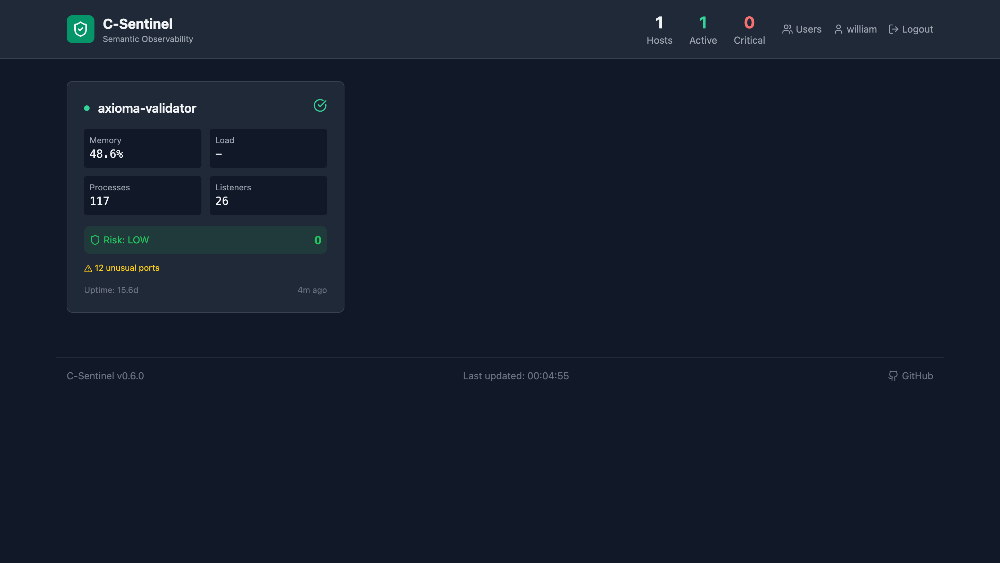
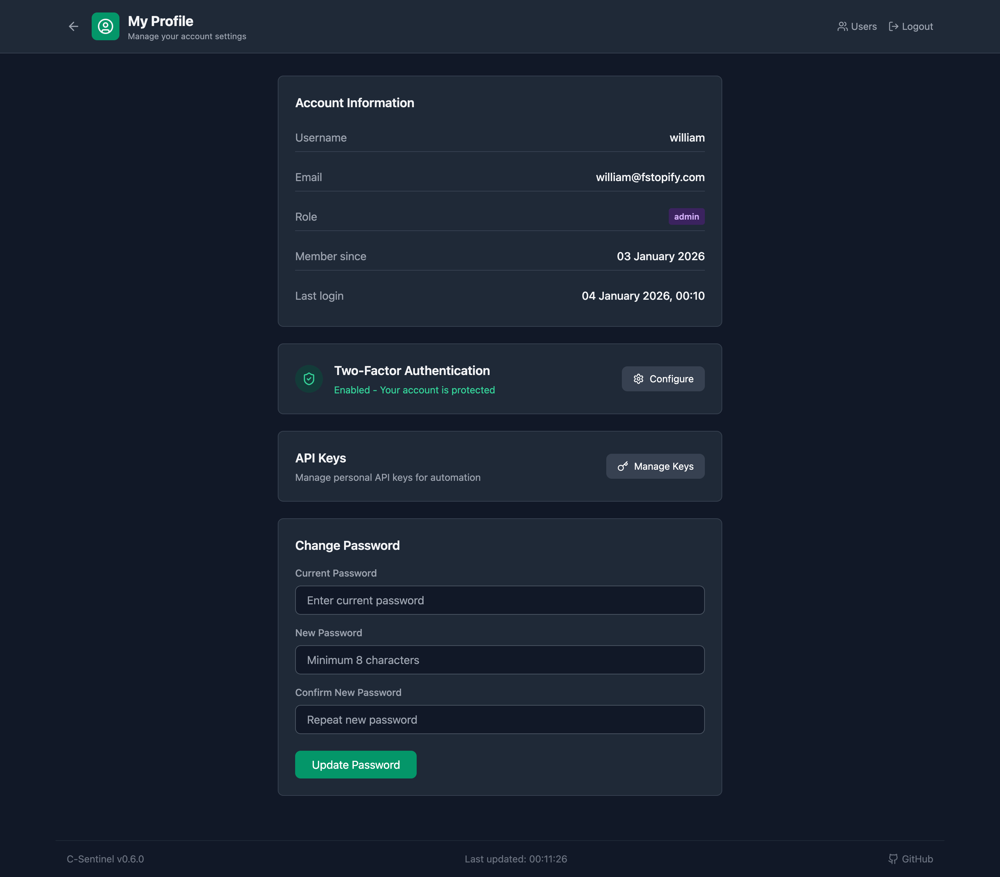
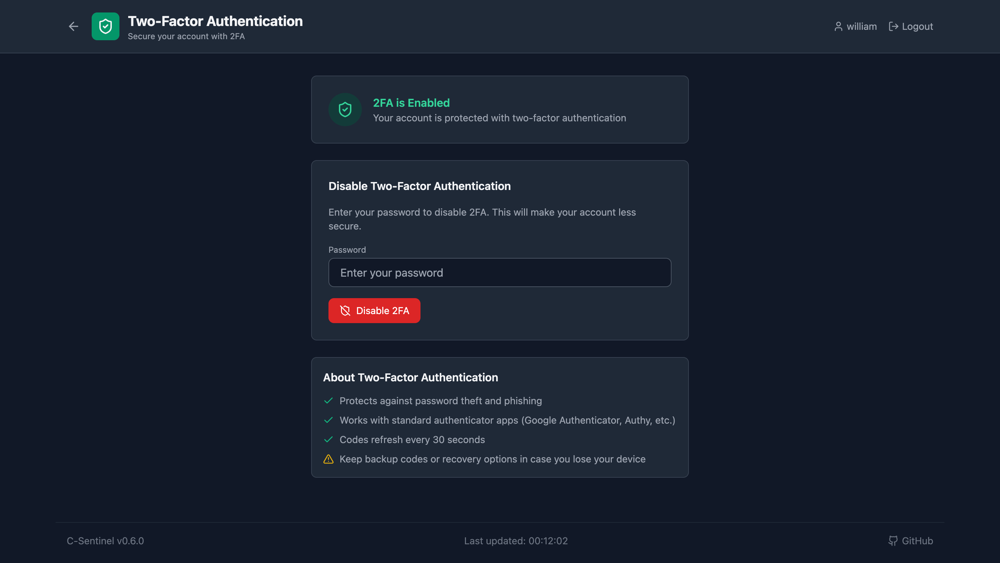
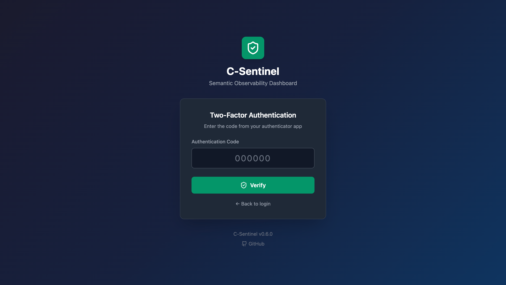
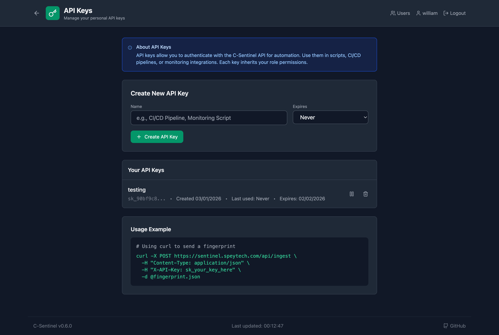
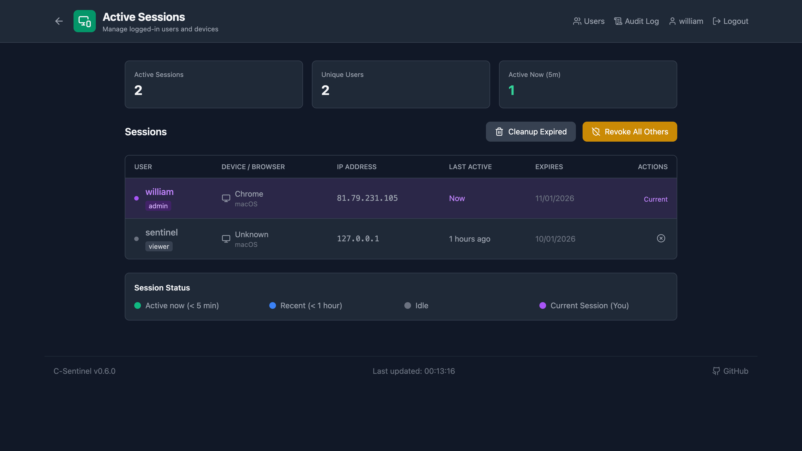
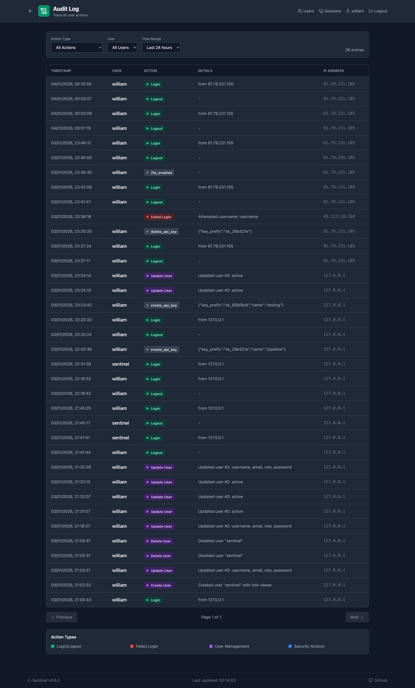
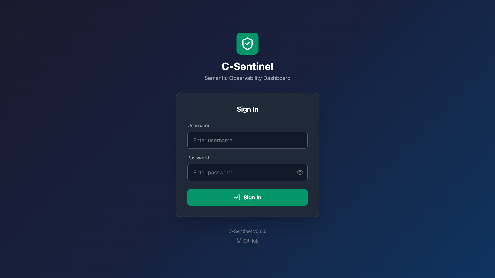

# C-Sentinel

**Semantic Observability for UNIX Systems - Now with AIX Support!**

A lightweight, portable system prober written in C that captures "system fingerprints" for AI-assisted analysis of non-obvious risks. Features auditd integration, explainable risk scoring, and a live web dashboard with enterprise-grade multi-user authentication.

[](https://opensource.org/licenses/MIT)


**Live Demo**: [sentinel.speytech.com](https://sentinel.speytech.com)

---

## Join the Community

LibrePower is more than AIX—we're building open source support across the entire IBM Power ecosystem: AIX, IBM i, and Linux on Power (ppc64le).

📬 **[Subscribe to our newsletter](https://librepower.substack.com/subscribe)** for releases, technical articles, and community updates.

🌐 **[librepower.org](https://librepower.org)** — Launching February 2026

---

## ⚠️ IMPORTANT: Development Status

**AIX Port Status: ACTIVE DEVELOPMENT - NOT YET PRODUCTION READY**

The AIX 7.1/7.2/7.3 port is currently under active development and testing. While core functionality is working (~95% feature parity), we are still:

- ✅ **Working:** System monitoring, process tracking, network monitoring with PID attribution (70+ ports), configuration drift detection, baseline learning, web dashboard
- ✅ **Completed:** PID attribution for network ports using intelligent heuristics (SSH, databases, IBM middleware, SAP, etc.)
- ⏳ **Planned:** AIX audit subsystem integration, production hardening, extensive enterprise environment testing

**Recommendations:**
- **Linux users:** Fully production-ready, deploy with confidence
- **AIX users:** Suitable for development, testing, and pilot deployments. Production use should be evaluated on a case-by-case basis
- **Testing welcome:** We actively encourage testing in AIX environments and welcome feedback via [GitHub Issues](https://github.com/librepower/c-sentinel4aix/issues)

**Timeline:** Targeting production-ready status for AIX by Q2 2026 pending community testing and feedback.

---

## 🎉 What's New in v1.0.0-aix

### **AIX 7.1/7.2/7.3 Support - Active Development**

C-Sentinel is now **ported to IBM AIX** with ~95% feature parity:

- ✅ **System Monitoring** - libperfstat integration (uptime, load, memory)
- ✅ **Process Monitoring** - Full /proc/psinfo support (408+ processes tracked)
- ✅ **Config File Monitoring** - SHA256 checksums, drift detection
- ✅ **Network Monitoring** - TCP/UDP listeners with **PID attribution (70+ ports)**
- ✅ **Process Chain Analysis** - Detect suspicious parent-child relationships
- ✅ **Baseline Learning** - Anomaly detection and deviation alerts

**Platform-Specific Documentation:**
- **[AIX Installation & Usage Guide →](README.AIX.md)**
- **[Complete AIX Port Status →](AIX_PORT_STATUS.md)**

### Compilation on AIX

```bash
# Clone repository
git clone https://github.com/librepower/c-sentinel4aix.git
cd c-sentinel4aix

# Compile with AIX-specific Makefile
/opt/freeware/bin/make -f Makefile.aix

# Run
./bin/sentinel -q
```

**Requirements:** GCC from AIX Toolbox, libperfstat, libodm, libcfg

---

## Screenshots

### Security Dashboard


### Multi-Host Overview


### User Profile & Security Settings


### Two-Factor Authentication
| Setup | Login |
|-------|-------|
|  |  |

### Personal API Keys


### Admin Features

#### Session Management


#### Audit Log


### Secure Login


## Previous Releases

**v0.6.0**: Multi-user authentication, 2FA, personal API keys, admin audit log, session management, email/Slack alerts, mobile responsive

**v0.5.x**: Security posture summary, risk trend sparkline, learning indicator, explainable risk factors, email alerts, event history

**v0.4.0**: Auditd integration, brute force detection, privacy-preserving username hashing, process attribution, risk scoring

**v0.3.0**: Web Dashboard, SHA256 checksums, systemd service, baseline learning, network probe, watch mode

## The Problem

Modern observability tools like Dynatrace, Datadog, and Prometheus are excellent at metric collection and threshold alerting. But they answer a narrow question: *"Is this metric outside its expected range?"*

They struggle with:
- **Causal reasoning**: *Why* did something fail?
- **Context synthesis**: Connecting a config change last week to today's latency spike
- **Non-obvious degradation**: Things that aren't "broken" but are drifting toward failure
- **Security context**: Understanding *who* accessed *what* and *why it matters*

C-Sentinel takes a different approach: capture a comprehensive system fingerprint—including security events—and use LLM reasoning to identify the "ghosts in the machine."

## Quick Start

### Linux

```bash
# Clone and build
git clone https://github.com/librepower/c-sentinel4aix.git
cd c-sentinel4aix
make

# Quick analysis
./bin/sentinel --quick --network

# Quick analysis with security events (requires root for audit logs)
sudo ./bin/sentinel --quick --network --audit

# Learn baselines (automatic with --audit flag)
./bin/sentinel --learn --network

# Continuous monitoring with full context
sudo ./bin/sentinel --watch --interval 300 --network --audit
```

### AIX 7.x

```bash
# Clone and build
git clone https://github.com/librepower/c-sentinel4aix.git
cd c-sentinel4aix
/opt/freeware/bin/make -f Makefile.aix

# Quick analysis (use short options on AIX)
./bin/sentinel -q -n

# Learn baseline
./bin/sentinel -l -n

# Continuous monitoring
./bin/sentinel -w -i 300 -n
```

**Important:** On AIX, use **short options** (`-q`, `-n`) instead of long options (`--quick`, `--network`) due to getopt limitations.

See **[README.AIX.md](README.AIX.md)** for complete AIX documentation.

## Dashboard Features

The web dashboard provides real-time security monitoring across your infrastructure.

### Multi-User Authentication

- **Role-Based Access Control**: Admin, Operator, and Viewer roles
- **Two-Factor Authentication**: TOTP support with any authenticator app
- **Personal API Keys**: Per-user keys for automation and CI/CD integration
- **Session Management**: View active sessions, revoke access, force logout
- **Admin Audit Log**: Track all user actions with filtering and search

### Security Monitoring

- **Real-time Alerts**: Email and Slack notifications with rich formatting
- **Risk Scoring**: Explainable risk factors with baseline deviation tracking
- **Process Attribution**: Track which process accessed sensitive files
- **Brute Force Detection**: Automatic detection of authentication attacks
- **Config Drift Detection**: SHA256 checksums with change notifications

### System Monitoring

- **Multi-Host Dashboard**: Monitor multiple servers from one interface
- **Network Visibility**: Track listeners, connections, and unusual ports
- **Process Monitoring**: Detect zombies, leaks, and long-running processes
- **Baseline Learning**: Automatic learning of normal system behavior
- **Trend Analysis**: Historical data with sparklines and charts

## Platform Support Matrix

| Feature | Linux | AIX 7.1/7.2/7.3 | Notes |
|---------|-------|-----------------|-------|
| System Info | ✅ | ✅ | Full support |
| Process Monitoring | ✅ | ✅ | Full support |
| Config File Monitoring | ✅ | ✅ | Full support |
| Network Monitoring | ✅ | ✅ | AIX: **PID attribution (70+ ports)** |
| Audit Integration | ✅ | ❌ | AIX: Planned for future |
| Baseline Learning | ✅ | ✅ | Full support |
| Web Dashboard | ✅ | ✅ | Full support (requires PostgreSQL) |
| Long Options (--xxx) | ✅ | ❌ | AIX: Use short (-x) |

**Legend:** ✅ Fully supported | ⚠️ Limited | ❌ Not available

## Installation

### Linux

#### From Source

```bash
git clone https://github.com/librepower/c-sentinel4aix.git
cd c-sentinel4aix
make
sudo make install
```

#### System Service

```bash
# Copy systemd service file
sudo cp deploy/sentinel.service /etc/systemd/system/
sudo systemctl daemon-reload
sudo systemctl enable sentinel
sudo systemctl start sentinel
```

### AIX

```bash
# Compile
/opt/freeware/bin/make -f Makefile.aix

# Install binaries
/opt/freeware/bin/make -f Makefile.aix install
# Or manually:
cp bin/sentinel /usr/local/bin/
cp bin/sentinel-diff /usr/local/bin/
```

See **[README.AIX.md](README.AIX.md)** for complete AIX setup instructions.

## Dashboard Setup

The web dashboard provides multi-user authentication and real-time monitoring.

### Quick Start

```bash
cd dashboard
npm install
npm start
```

The dashboard will be available at http://localhost:3000

### Production Deployment

```bash
# Build frontend
cd dashboard
npm run build

# Configure and start backend
export JWT_SECRET="your-secret-key"
export SMTP_HOST="smtp.gmail.com"
export SMTP_USER="alerts@example.com"
export SMTP_PASS="your-password"

npm run server
```

### First User Setup

The first user registered becomes the admin. Subsequent users require admin approval.

### Environment Variables

```bash
# Required
JWT_SECRET=your-random-secret-key

# Email Alerts (Optional)
SMTP_HOST=smtp.gmail.com
SMTP_PORT=587
SMTP_USER=your-email@gmail.com
SMTP_PASS=your-app-password

# Slack Alerts (Optional)
SLACK_WEBHOOK_URL=https://hooks.slack.com/services/YOUR/WEBHOOK/URL

# Public Demo Mode (Optional)
PUBLIC_DEMO_MODE=true  # Enables read-only access without login
```

## Usage Examples

### Basic System Analysis

```bash
# Quick overview (Linux)
./bin/sentinel --quick

# Quick overview (AIX)
./bin/sentinel -q

# With network information
./bin/sentinel -q -n

# JSON output for automation
./bin/sentinel -j -q > fingerprint.json
```

### Security Monitoring

```bash
# Include audit events (Linux only, requires root)
sudo ./bin/sentinel --quick --audit

# Watch mode with alerts
sudo ./bin/sentinel --watch --interval 60 --audit --network
```

### Baseline Learning

```bash
# Learn normal system state
./bin/sentinel --learn

# Compare against baseline
./bin/sentinel --baseline --quick

# Learn audit baseline (Linux)
sudo ./bin/sentinel --audit-learn
```

### Configuration Monitoring

```bash
# Monitor specific files
./bin/sentinel /etc/ssh/sshd_config /etc/passwd /etc/sudoers

# Compare two fingerprints
./bin/sentinel-diff fingerprint1.json fingerprint2.json
```

## Architecture

### Core Components

- **sentinel** - C binary that probes system state
- **sentinel-diff** - Compares two system fingerprints
- **Dashboard** - React frontend with Node.js backend
- **Baseline Engine** - Learns normal system behavior
- **Alert System** - Email and Slack notifications

### Data Flow

```
System → sentinel probe → JSON fingerprint → Dashboard → LLM Analysis → Alerts
                              ↓
                         Baseline Learning
```

### Security

- All passwords hashed with bcrypt
- JWT tokens for API authentication
- TOTP-based two-factor authentication
- Personal API keys with scoped permissions
- Rate limiting on authentication endpoints
- Audit logging of all admin actions

## Configuration

### Sentinel Configuration

Create `~/.sentinel/config` or `/etc/sentinel/config`:

```ini
[sentinel]
# Baseline storage location
baseline_path = ~/.sentinel/baseline.dat

# Audit baseline
audit_baseline_path = ~/.sentinel/audit_baseline.dat

# Default monitoring options
include_network = true
include_audit = true
watch_interval = 300
```

### Dashboard Configuration

See `dashboard/config.example.js` for full configuration options.

## API Reference

### REST API Endpoints

```bash
# Get system fingerprint
curl http://localhost:3001/api/fingerprint

# Submit new fingerprint
curl -X POST http://localhost:3001/api/fingerprint \
  -H "Content-Type: application/json" \
  -d @fingerprint.json

# Get all hosts
curl http://localhost:3001/api/hosts

# Get alerts
curl http://localhost:3001/api/alerts
```

See full API documentation in `docs/API.md`

## Development

### Building from Source

```bash
# Linux
make clean
make DEBUG=1

# AIX
/opt/freeware/bin/make -f Makefile.aix clean
/opt/freeware/bin/make -f Makefile.aix DEBUG=1
```

### Running Tests

```bash
# Run test suite (Linux)
make test

# Static analysis
make lint

# Format code
make format
```

### Contributing

Contributions are welcome! Please see [CONTRIBUTING.md](CONTRIBUTING.md) for guidelines.

## Platform-Specific Notes

### AIX Limitations

1. **Network PIDs**: ✅ **SOLVED** - PIDs now detected via intelligent heuristics for 70+ well-known ports (SSH, databases, IBM middleware, SAP, etc.)
2. **Audit System**: AIX uses different audit framework (planned for future release)
3. **Long Options**: Must use short options (`-q` instead of `--quick`)

See **[AIX_PORT_STATUS.md](AIX_PORT_STATUS.md)** for complete technical details.

### Known Issues

- AIX: Audit subsystem not yet implemented
- AIX: Network monitoring shows `[unknown]` for non-standard ports (expected behavior)
- Linux: Some audit events require specific auditd rules

## Troubleshooting

### Common Issues

**Linux: "auditd not available"**
```bash
# Install auditd
sudo apt-get install auditd  # Debian/Ubuntu
sudo yum install audit       # RHEL/CentOS

# Start service
sudo systemctl start auditd
```

**AIX: "command not found"**
```bash
# Verify GCC installation
which /opt/freeware/bin/gcc

# If missing, install AIX Toolbox
# https://www.ibm.com/support/pages/aix-toolbox-linux-applications
```

**AIX: "libperfstat not found"**
```bash
# Verify library exists
ls -la /usr/lib/libperfstat.a

# If missing, install from AIX installation media
installp -a -d /dev/cd0 bos.perf.libperfstat
```

### Getting Help

- **Issues**: https://github.com/librepower/c-sentinel4aix/issues
- **Discussions**: https://github.com/librepower/c-sentinel4aix/discussions
- **Documentation**: See `docs/` directory

## License

MIT License - see [LICENSE](LICENSE) file for details

## Acknowledgments

- Original project: [williamofai/c-sentinel](https://github.com/williamofai/c-sentinel)
- AIX port: LibrePower team
- Contributors: See [CONTRIBUTORS.md](CONTRIBUTORS.md)

## Citation

If you use C-Sentinel in your research or production environment, please cite:

```bibtex
@software{c_sentinel,
  title = {C-Sentinel: Semantic Observability for UNIX Systems},
  author = {William Murray and LibrePower Team},
  year = {2025},
  url = {https://github.com/librepower/c-sentinel4aix},
  version = {1.0.0-aix}
}
```

---

**Version:** 1.0.0-aix
**Last Updated:** 2026-01-05
**Supported Platforms:** Linux (all), AIX 7.1, AIX 7.2, AIX 7.3
**License:** MIT
