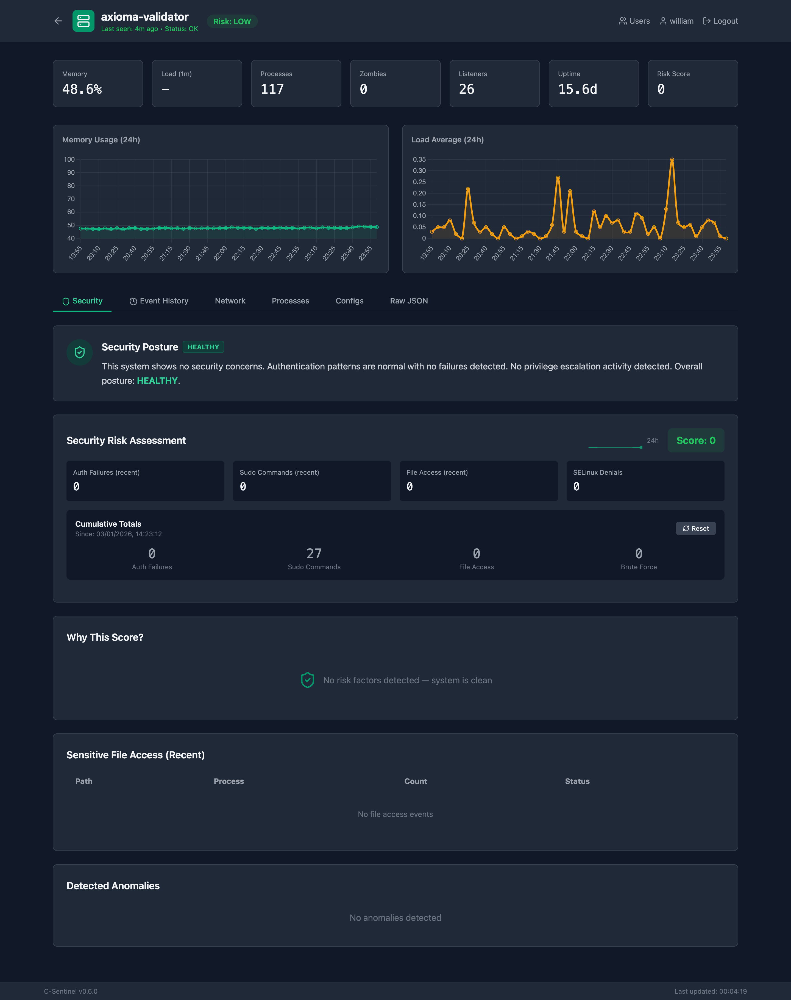

# C-Sentinel Dashboard

A web dashboard for viewing system fingerprints across multiple hosts.



## Features

- **Real-time host monitoring** - See all hosts at a glance
- **Historical charts** - Memory and load over 24 hours
- **Network view** - All listening ports and connections
- **Config tracking** - SHA256 checksums of monitored files
- **Multi-host support** - Monitor your entire fleet

## Quick Start

### Prerequisites

- Python 3.11+
- PostgreSQL
- Nginx (for reverse proxy)

### Installation

```bash
# Create database
sudo -u postgres psql -c "CREATE DATABASE sentinel;"
sudo -u postgres psql -c "CREATE USER sentinel WITH ENCRYPTED PASSWORD 'your-password';"
sudo -u postgres psql -c "GRANT ALL PRIVILEGES ON DATABASE sentinel TO sentinel;"

# Install dashboard
export DB_PASSWORD="your-password"
chmod +x install-dashboard.sh
sudo -E ./install-dashboard.sh

# Get SSL certificate
sudo certbot --nginx -d sentinel.yourdomain.com

# Start services
sudo systemctl enable sentinel-dashboard
sudo systemctl start sentinel-dashboard
sudo systemctl reload nginx
```

### Configure Agents

Add to crontab on each monitored host:

```bash
*/5 * * * * /usr/local/bin/sentinel --json --network | curl -s -X POST \
  -H "Content-Type: application/json" \
  -H "X-API-Key: YOUR_API_KEY" \
  -d @- https://sentinel.yourdomain.com/api/ingest >/dev/null 2>&1
```

## API Endpoints

| Endpoint | Method | Description |
|----------|--------|-------------|
| `/api/ingest` | POST | Receive fingerprint (requires API key) |
| `/api/hosts` | GET | List all hosts with latest stats |
| `/api/hosts/<hostname>` | GET | Get host details and history |
| `/api/hosts/<hostname>/latest` | GET | Get latest full fingerprint |
| `/api/stats` | GET | Overall statistics |
| `/health` | GET | Health check |

## Configuration

Environment variables for the service:

| Variable | Default | Description |
|----------|---------|-------------|
| `DB_HOST` | localhost | PostgreSQL host |
| `DB_PORT` | 5432 | PostgreSQL port |
| `DB_NAME` | sentinel | Database name |
| `DB_USER` | sentinel | Database user |
| `DB_PASSWORD` | - | Database password |
| `SENTINEL_API_KEY` | - | API key for ingestion |

## Files

| File | Purpose |
|------|---------|
| `app.py` | Flask application |
| `templates/index.html` | Dashboard home page |
| `templates/host.html` | Host detail page |
| `requirements.txt` | Python dependencies |
| `sentinel-dashboard.service` | Systemd service |
| `nginx-sentinel.conf` | Nginx configuration |
| `install-dashboard.sh` | Installation script |
| `sentinel-push` | Helper script for agents |

## Architecture

```
┌─────────────────────────────────────────┐
│          sentinel.yourdomain.com        │
│              (Nginx + SSL)              │
└─────────────────┬───────────────────────┘
                  │
                  ▼
┌─────────────────────────────────────────┐
│         Flask Dashboard (Gunicorn)      │
│              Port 5000                  │
└─────────────────┬───────────────────────┘
                  │
                  ▼
┌─────────────────────────────────────────┐
│            PostgreSQL                   │
│         (JSONB storage)                 │
└─────────────────────────────────────────┘
                  ▲
                  │
┌─────────────────┴───────────────────────┐
│  Host 1    │    Host 2    │    Host N   │
│ (sentinel) │  (sentinel)  │  (sentinel) │
└─────────────────────────────────────────┘
```

## License

MIT License - see [LICENSE](../LICENSE) for details.
