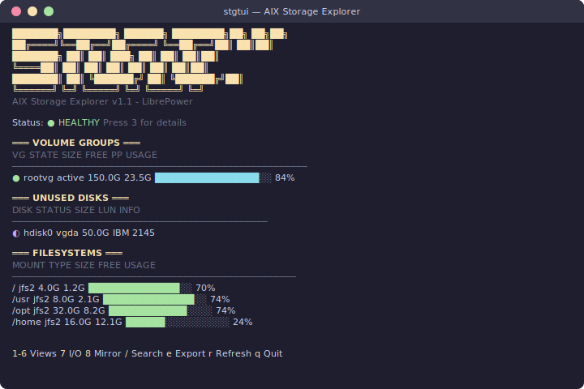

# stgtui - AIX Storage Explorer

**Professional Terminal User Interface for AIX LVM/SAN Management**

A LibrePower original tool, created exclusively for AIX.


## Demo



## Features

### Views (press number keys)

| Key | View | Description |
|-----|------|-------------|
| `1` | Dashboard | System overview with VG/FS usage bars and health status |
| `2` | VG Details | Volume Groups with PV breakdown, quorum status |
| `3` | Health Check | Comprehensive storage health: stale PPs, paths, capacity, errpt |
| `4` | LV Status | All Logical Volumes with sync state |
| `5` | Disk → FS | Navigate from LUN/PV to VG to LV to Filesystem |
| `6` | FS → Disk | Navigate from Filesystem to LV to VG to PV/LUN |
| `7` | I/O Stats | Real-time iostat metrics per disk |
| `8` | Mirror | Mirror status for all LVs (single/2-way/3-way) |

### Key Features

- **Health monitoring**: stale PPs, multipath status, quorum, capacity alerts, errpt disk errors
- **Unused disk detection**: Shows disks not in any VG with status indicators
  - `○` clean disk (ready for `mkvg`)
  - `◐` has VGDA remnants (needs `chpv -C` to clear)
- **Multipath/SAN support**: lspath status for FC and vSCSI
- **LUN identification**: PVID, unique_id, MPIO vendor/product
- **Bidirectional navigation**: FS ↔ LV ↔ VG ↔ PV ↔ LUN
- **Visual progress bars**: Color-coded (green/yellow/red)
- **Search** (`/`): Find VGs, LVs, FSs, disks
- **Export** (`e`): Save current view to `/tmp/stgtui-report-*.txt`
- **NFS mounts**: Included in filesystem views
- **Config file**: `~/.stgtuirc` for custom thresholds
- **vim keys**: `j/k` scroll, `g/G` top/bottom
- **Compatible with linux-compat**: Works with both AIX native and GNU df

### Keyboard Shortcuts

| Key | Action |
|-----|--------|
| `1-8` | Switch views |
| `/` | Search |
| `e` | Export current view |
| `r` | Refresh |
| `j/k` | Scroll down/up |
| `g/G` | Go to top/bottom |
| `Esc` | Go back |
| `q` | Quit |

## Installation

```bash
# Via DNF (recommended)
dnf install stgtui

# Or manual RPM install
rpm -ivh stgtui-1.1.0-1.librepower.aix7.3.ppc.rpm
```

## Configuration

Create `~/.stgtuirc` to customize thresholds:

```ini
# Warning threshold (yellow) - default 85%
warn_threshold=85

# Critical threshold (red) - default 90%
crit_threshold=90
```

## Compatibility

- AIX 7.2, 7.3
- VIOS 3.x, 4.x
- Works with any storage: vSCSI, Fiber Channel, SAN arrays (EMC, IBM, NetApp, Hitachi, Pure, etc.)

## Building from Source

Requires Go 1.21+ (IBM Open SDK for Go on AIX):

```bash
cd /root/go-builds/stgtui
go build -o stgtui main.go
```

## Links

- 📦 **Repository**: [aix.librepower.org](https://aix.librepower.org)
- 🌐 **LibrePower**: [librepower.org](https://librepower.org)
- 📬 **Newsletter**: [librepower.substack.com](https://librepower.substack.com/subscribe)

## License

Apache-2.0

---

*A LibrePower original tool for AIX sysadmins*
